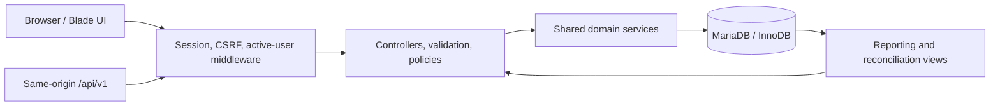

# NexaStock

**A database-first inventory, sales, and customer-history application built for CSE311.**

[](inventory/composer.json)
[](docs/ENVIRONMENT_EVIDENCE.md)
[](docs/ENVIRONMENT_EVIDENCE.md)
[](docs/IMPLEMENTATION_STATUS.md)

NexaStock models a small store where staff receive and correct stock, record multi-item sales, manage customers, cancel a sale once, and reconcile every inventory balance against an immutable movement ledger. It is a focused academic project: the interesting work is in relational design, constraints, transactions, concurrency, idempotency, authorization, and measurable reporting.

The current application is under [`inventory/`](inventory/README.md). The root `app/` and `sql/` directories preserve the initial plain-PHP CRM prototype as comparison material and are never used by NexaStock.

## Why this project is technically interesting

- Atomic multi-item sales lock products in ascending ID order, validate current prices and stock, then commit the sale, item snapshots, balance changes, and ledger movements together.
- UUID request keys and canonical SHA-256 fingerprints make retries safe while detecting changed payloads.
- Completed sales can be cancelled once; the reversal is transactional and restores archived-product stock without erasing history.
- Stock movements and sale items are append-only through application workflows. Reconciliation compares cached balances with the ledger.
- Manager and sales-clerk capabilities are enforced by server-side policies as well as the interface.
- Money is handled as exact decimal strings, actors come from the authenticated session, and local calendar reports use explicit Asia/Dhaka-to-UTC boundaries.

## System shape



The UI and JSON API call the same services, so business rules do not diverge between presentation layers. Seven normalized business tables hold users, categories, products, customers, sales, sale items, and stock movements. Laravel migrations are the executable schema authority; the reference SQL mirrors their design.

## Implemented workflows

| Area | Capabilities |
|---|---|
| Access | Session login/logout, throttling, active-user checks, manager and clerk policies |
| Catalog | Category and product management, archival/restoration, optimistic versions, bounded search |
| Inventory | Restock and correction commands with reasons, idempotency, limits, and append-only movements |
| Customers | Create/edit/archive/restore, search, and complete sale history |
| Sales | Multi-item cart, price review, exact totals, receipt snapshots, once-only cancellation |
| Reports | Inventory, low stock, recorded sales value, top products, histories, reconciliation, CSV export |
| Interfaces | Responsive Blade application plus documented same-origin `/api/v1` endpoints |

## Verification

The last complete local verification used the actual XAMPP MariaDB engine:

- 20 PHPUnit tests and 97 assertions passed.
- Two independent-process tests exercised a last-unit race and simultaneous retries of one idempotency key.
- Pint, Blade compilation, the Vite production build, and OpenAPI validation passed.
- Composer and npm reported no known vulnerabilities at the recorded check.
- Runtime database permissions denied history mutation and DDL operations.
- The seeded demonstration reconciled with zero inventory differences.

See [implementation status](docs/IMPLEMENTATION_STATUS.md) for the exact evidence boundary and unresolved acceptance exercises. A workflow file existing in this repository is not itself proof of a successful GitHub Actions run.

## Run locally

The measured course environment uses XAMPP PHP 8.2 and MariaDB 10.4. Do not point setup, seeding, or tests at a database containing valuable data.

```powershell
cd inventory
Copy-Item .env.example .env
composer install
npm ci
npm run build
php artisan key:generate
php artisan migrate
```

Database accounts and a synthetic demonstration seed require the guarded steps in [setup and operations](docs/SETUP_AND_OPERATIONS.md). Tests refuse to run unless `APP_ENV=testing`, the connection is MariaDB, and the database is exactly `nexastock_test`.

## Documentation map

| Start here | Purpose |
|---|---|
| [SRS](docs/SRS.md) | Required behavior, roles, rules, and acceptance criteria |
| [Database design](docs/DATABASE_DESIGN.md) | ERD, functional dependencies, normalization, keys, indexes, and transaction design |
| [Architecture](docs/ARCHITECTURE.md) | Framework choices and responsibility boundaries |
| [OpenAPI](docs/openapi.yaml) | Versioned JSON interface contract |
| [Test plan](docs/TEST_PLAN.md) | Requirement-to-test mapping and race scenarios |
| [Theory guide](theory/README.md) | DBMS, SQL, Laravel, JavaScript/React, and PostgreSQL learning path |
| [Future portfolio plan](inventory/docs/FUTURE_PORTFOLIO_PLAN.md) | Post-semester React, PostgreSQL, hosting, webhook, social, and assistant roadmap |

## Academic scope and honesty

The semester release covers one store, whole-unit stock, BDT, optional customers, completed sales, and full cancellation. It does not claim payment processing, profit accounting, warehouses, suppliers, reservations, partial returns, forecasting, multi-tenancy, or production deployment.

React, PostgreSQL, managed hosting, webhooks, social publishing, and an evaluated assistant are documented future milestones. They belong on a CV only after implementation and reproducible verification. The repository provides extensive theory and code, but the student should be able to write the SQL, explain the lock schedules, and defend the design independently.

Product screenshots will be added after the planned interface redesign and responsive accessibility review. The current repository does not present unfinished local UI as portfolio evidence.
