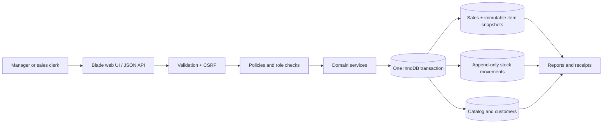

# NexaStock

A transaction-focused inventory, sales, and customer-history system built for CSE311 DBMS coursework. The repository name retains its original `CSE311-CRM` label; **NexaStock** is the application name.

The working Laravel application is in [`inventory/`](inventory/README.md). The root `app/` and `sql/` directories preserve the initial plain-PHP prototype for comparison and are not used by the Laravel application.

## Features

- Category, product, and customer management
- Stock restocking and corrections with an append-only movement history
- Multi-item sales, receipts, and once-only sale cancellation
- Inventory, low-stock, sales, customer-history, and reconciliation reports
- Manager and sales-clerk access control
- Same-origin JSON API backed by the same services as the web interface

## System at a glance



The main design problem is keeping the cached stock balance, immutable ledger, sale items, and cancellation state consistent under retries and concurrent requests. [Portfolio overview](docs/PORTFOLIO_OVERVIEW.md) traces that workflow from request validation through locking, commit, reconciliation, and tests.

## Stack

- Laravel 12 and PHP 8.2
- MariaDB 10.4 through XAMPP
- Blade, JavaScript, CSS, and Vite
- PHPUnit and GitHub Actions

## Local setup

```powershell
cd inventory
Copy-Item .env.example .env
composer install
npm ci
npm run build
php artisan key:generate
php artisan migrate
```

Database account setup, demo data, and test commands are documented in [Setup and Operations](docs/SETUP_AND_OPERATIONS.md). Tests are restricted to `APP_ENV=testing` with the MariaDB database `nexastock_test`.

## Documentation

- [Software requirements specification](docs/SRS.md)
- [Database design and ERD](docs/DATABASE_DESIGN.md)
- [Architecture](docs/ARCHITECTURE.md)
- [API specification](docs/openapi.yaml)
- [Test plan](docs/TEST_PLAN.md)
- [Portfolio overview and transaction walkthrough](docs/PORTFOLIO_OVERVIEW.md)
- [DBMS and implementation theory guide](theory/README.md)

The database and backend coursework is implemented. The latest recorded local verification is **20 PHPUnit tests / 97 assertions**, including two-process last-unit and same-key races, with zero ledger drift in the service-driven fixture. See [implementation status](docs/IMPLEMENTATION_STATUS.md) for the environment and remaining acceptance gates.

The interface will be redesigned later; screenshots are intentionally omitted until the visual work represents the final application. The architecture and transaction diagrams document the current implemented behavior in the meantime.

