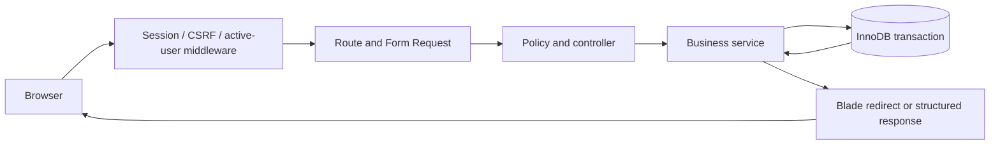

# Framework and architecture decisions

Baseline: 9 September 2026. Behavior: [SRS](SRS.md). Data: [database design](DATABASE_DESIGN.md).

## Decision: Laravel on XAMPP

Use a Laravel monolith, Blade templates, compiled local CSS/Tailwind through Vite, and the approved XAMPP InnoDB database. Laravel supplies routing, validation, sessions, CSRF middleware, authorization policies, migrations, and test integration. Learn the SQL underneath it; an ORM is not evidence of DBMS mastery.

XAMPP commonly bundles MariaDB despite a MySQL control-panel label. Measure SELECT VERSION() and the PHP version first. XAMPP is a local development environment, not the public deployment stack. [Apache Friends FAQ](https://www.apachefriends.org/faq_windows.html)

### Compatibility gate

| Measured course environment | Framework decision |
|---|---|
| PHP 8.3–8.5, required extensions and supported DB; framework allowed | Prefer Laravel 13, latest compatible patched release. |
| Required PHP 8.2 installation | Laravel 12, latest compatible patch; security-only maintenance until 24 February 2027. Plan upgrade before that date. |
| Older PHP or unsupported database | Resolve course-approved runtime compatibility before scaffolding. Do not silently select an unsupported framework. |

Laravel 12 supports PHP 8.2–8.5; its ordinary bug-fix window ended 13 August 2026. Laravel 13 requires PHP >=8.3. Exact Composer/Node/package versions belong in environment evidence and lockfiles when installed. [Laravel support policy](https://laravel.com/docs/12.x/releases), [Laravel 13 deployment requirements](https://laravel.com/docs/13.x/deployment)

The three-month schedule fits the stated Laravel 12 security window, but public maintenance beyond that window requires an upgrade. Instructor acceptance of Laravel is an open administrative gate; XAMPP alone does not establish permission to use a framework.

## Layer choices

| Concern | Baseline |
|---|---|
| Runtime/web | XAMPP PHP + Apache; virtual host document root inventory/public |
| Backend | Laravel MVC, explicit business services, Form Requests, Policies |
| Persistence | Eloquent for simple CRUD; Query Builder/parameterized SQL for reports and visible transaction logic |
| Database | One actual approved MariaDB/MySQL version, InnoDB, utf8mb4, strict SQL mode |
| Authentication | Laravel session guard, Hash, Auth login/logout; locally provisioned users, no registration |
| Frontend | Blade + semantic HTML, responsive compiled styles; vanilla JS progressively |
| Assets | Vite; Node is a build tool, not a second backend |
| Tests | Framework-compatible PHPUnit, actual-engine integration tests, browser checks |
| Quality | Laravel Pint, Composer/npm lockfiles, GitHub CI after implementation |
| Sessions/cache | File drivers initially; document infrastructure tables if later switching to database drivers |
| Later | React with Inertia against the same Laravel services; PostgreSQL in a separate migration milestone |

Use Laravel's authentication services in a small login controller; do not invent password cryptography. Regenerate the session on login; invalidate session and regenerate CSRF token on logout. Implement active-user checks on protected requests. Set configurable 30-minute idle and 8-hour absolute lifetimes, and login throttling. HTTPS deployments use Secure/HttpOnly/SameSite cookies; test local HTTP differences explicitly.

Laravel transactions can roll back exception failures and support bounded deadlock retries. Every retried closure must contain only retry-safe database work. [Laravel database transactions](https://laravel.com/docs/12.x/database)

## Proposed directory structure

This structure is implemented under `inventory/`; `docs/IMPLEMENTATION_STATUS.md` records executed evidence and remaining gates.

```text
inventory/
  app/Http/Controllers/       ProductController, SaleController, StockController, ...
  app/Http/Requests/          StoreProductRequest, RecordSaleRequest, ...
  app/Models/                 seven business models with explicit fillable fields
  app/Policies/               ProductPolicy, SalePolicy, CustomerPolicy, ...
  app/Services/               RecordSale, CancelSale, AdjustStock
  app/Queries/                InventoryReports, SalesReports, Reconciliation
  resources/views/            layouts, auth, catalog, customers, sales, reports
  resources/css/              compiled local styles
  resources/js/               vanilla JS first; React milestone later
  routes/web.php              session-authenticated browser routes
  database/migrations/        sole executable schema authority after build starts
  database/seeders/            synthetic demonstration data through domain rules
  database/factories/          valid test data builders
  tests/Unit/                 money parsing, canonical request fingerprints
  tests/Feature/              HTTP authorization, actual-DB transaction tests
  public/                    sole Apache document root
  storage/                   logs and file sessions; non-public
  bootstrap/cache/           framework cache; non-public
  .env.example               names and safe placeholders, no secrets
  composer.lock
  package-lock.json
```

Controllers adapt requests and responses. Form Requests validate shape and simple fields. Policies authorize. Services recheck mutable facts under locks and own transactions. Models describe relationships; templates only render escaped data. Query classes own report definitions. Do not add generic repositories or microservices for seven tables.



## Persistence boundaries

One service, one connection, one transaction per sale/cancellation/stock mutation. No network calls or rendering inside locks. Lock ordering and retry handling are specified in DATABASE_DESIGN. Eloquent model observers must not independently alter stock or add duplicate movements.

Mass assignment uses allowlists. Never accept actor, stock balance, status, fingerprint, total, cancellation actor, or archive timestamps from unrestricted request data. CSRF, role policies, validation and database constraints complement each other; none substitutes for the others.

Runtime DB account receives SELECT/INSERT/UPDATE only where needed, no DDL or DELETE; sale_items and stock_movements only SELECT/INSERT. Migrations use a separate administrative account. Avoid framework database sessions/cache initially so table-specific permissions remain simple.

No custom global exception messages leak SQL or credentials. Log operation/request ID and safe diagnostics. Money remains decimal strings; calculate derived totals in SQL or a tested decimal library, never float. UTC is set explicitly in application and connection.

## UI and future React

Screens: login; dashboard; catalog/list/editor; product detail with stock actions/history; customers/list/detail; sale cart; sale receipt; reports. Use a consistent navigation shell, readable tables, helpful empty states, visible pending state, and confirmation for cancellation. Stock conflict messages show the affected product and ask for review.

Weeks 1–8 build Blade flows. Learn JS modules, arrays, DOM, fetch, promises and errors alongside. React begins with a read-only catalog exercise; the later integrated UI can use Inertia, retaining Laravel routes/session security/services. Do not require a second API/backend or Next.js rewrite.

## Decision log

| Decision | Reason | Revisit trigger |
|---|---|---|
| Laravel + Blade first | XAMPP fit, useful conventions, lower initial frontend load | Stable semester release |
| SQL workbook beside ORM | Independently demonstrate database knowledge | Never remove learning evidence |
| One-store inventory | Good joins, M:N, constraints, concurrency, ledger examples | After course |
| Cached stock + append-only ledger | Fast availability checks plus reconciliation | Measured need or drift defect |
| No persisted sale total | Avoid redundant total updates; derive from snapshots | Measured report needs |
| React and PostgreSQL later | Separate learning variables | Passing baseline tests |
| No suppliers/warehouses/payments | Three-month learning budget | Separate scope revision |
