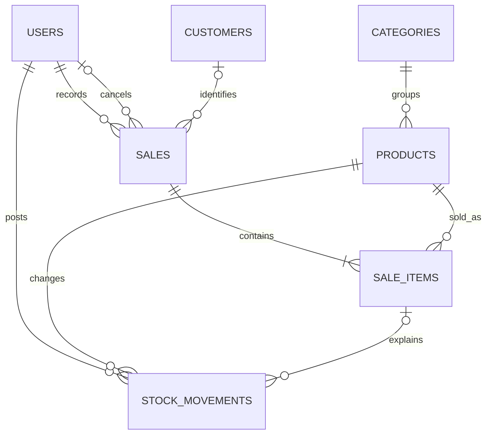

# Database design and transaction specification

Pre-build contract, 9 September 2026. Read [SRS](SRS.md), [reference DDL](schema/inventory_reference.mysql.sql), and [contracts](CONTRACTS.md) together. The SQL is non-destructive reference DDL, not a tested migration or an instruction to import into the old CRM database.

## Conceptual ERD

Each sale has one creator, zero/one canceller, zero/one customer. Each product has one category. Each sale must have 1–100 items at commit; the service enforces the minimum/maximum, not the FK. Each item must have one sale movement and, only for a cancelled sale, one cancellation movement. The last diagram edge is an approximation: actual allowed count/type is constrained by reason and workflow. Restocks/corrections have no sale item.

Sales ↔ products is M:N resolved by sale_items. A surrogate item ID is convenient for ledger references; UNIQUE(sale_id, product_id) still enforces one consolidated line per product.

## Physical dictionary

All IDs are BIGINT UNSIGNED primary keys in this reference dialect; use decimal strings in JSON for IDs to avoid JavaScript integer precision loss. Timestamps are application-supplied UTC DATETIME. Nullable fields are explicitly NULL in DDL. Restrict deletion of all referenced history.

| Table | Facts and key rules |
|---|---|
| users | name(100), canonical lowercase email(150) unique, Laravel password hash(255), manager/sales_clerk, active flag, timestamps. No plaintext password or public registration. |
| categories | canonical trimmed lowercase name(80) unique with utf8mb4_bin, version >=1, optional archived_at, timestamps. Application uses a consistent Unicode normalization policy (NFC then lowercase). |
| products | category FK, canonical SKU(64) unique ASCII binary, name(150), DECIMAL(10,2) price, bounded integer stock/reorder threshold, version/archive/timestamps. |
| customers | full_name(120), optional email(255)/phone(30), version/archive/timestamps. Names/email/phone do not identify a person uniquely. |
| sales | optional customer FK, creator FK, UUID request key unique, canonical fingerprint, status plus all-or-none cancellation metadata, timestamps. Receipt display ID is derived as NS-{id}. |
| sale_items | sale/product FKs, unique pair, quantity 1–1,000,000, snapshot unit price/name/SKU. No mutable line total. |
| stock_movements | product FK, optional matching item FK, nonzero signed delta, resulting stock, reason, actor FK, optional manual-operation key/fingerprint, note, UTC time. One movement per item/reason; manual keys unique. |

Names and notes are trimmed, with required text nonempty. Convert blank optional email/phone to NULL; validate email format without treating it as unique. Login email normalization is an explicit application policy (NFC, trim, lowercase); use the same normalizer at provisioning/login. SKU accepts only the SRS alphabet. DDL length/uniqueness constraints complement these application checks.

Use Laravel's default password field naming. Models for sale_items have timestamps disabled; movements have created_at only. File sessions/cache avoid mandatory extra infrastructure tables. If scaffolding supplies sessions/cache/jobs/password-reset tables, document and deliberately enable/remove their usage; seven business tables is not a claim of seven total tables.

## Enforcement matrix

| Invariant | Database | Service/verification |
|---|---|---|
| Nonnegative bounded stock | CHECK | Locked arithmetic, boundary tests |
| One SKU / one product per sale | UNIQUE | Normalize before insert, useful duplicate feedback |
| Movement references same product as item | Composite FK (sale_item_id, product_id) | Service copies product ID from validated line |
| At most one sale/cancel movement per item | UNIQUE(item, reason) | Exactly-one and magnitude validated by workflow/reconciliation |
| Cancellation metadata consistency | CHECK on sales row | Allowed transition and manager policy |
| At least one item per sale | Not enforced by FK | Atomic RecordSale; reconciliation detects empty headers |
| Balance equals movement sum | Cross-row, not CHECK | All stock writes through services; reconciliation |
| Initial stock is zero | DEFAULT is not a restriction | Creation allowlist forces zero; fixture services |
| Snapshot equals price/name at sale | Historical cross-table rule | Locked copy; later product changes don't rewrite snapshots |
| Active records, roles, stale version | Not ordinary FK | Policy/service recheck under relevant locks |
| Append-only history | Runtime grants deny UPDATE/DELETE on items/movements | No mutation UI; administrator remains privileged |

A CHECK that evaluates UNKNOWN can pass; nullable state fields therefore need explicit IS NULL/IS NOT NULL clauses. Verify enforcement rather than assuming the XAMPP label guarantees it. [MariaDB constraints](https://mariadb.com/docs/server/reference/sql-statements/data-definition/constraint)

## Functional dependencies and normalization

Under stated semantics:
- users: id -> all; canonical email -> all.
- categories: id -> all; canonical name -> all.
- products: id -> all; SKU -> all. Category ID does not determine product name/price.
- customers: id -> all; no email -> id assumption.
- sales: id -> all; request_key -> all.
- sale_items: id -> all; (sale_id, product_id) -> all. Product ID does not determine historical item price/name across sales.
- stock_movements: id -> all. Non-null manual request keys identify manual rows; SQL nullable UNIQUE is not a classical candidate key for the whole relation.

The master/header/item relations are consistent with BCNF under these declared FDs; this is conditional on the semantics, not a proof inferred from sample data. The mixed movement relation intentionally repeats product_id for linked items: sale_item_id -> product_id in that subset, while sale_item_id does not identify a movement (sale and cancellation both exist). Document this controlled redundancy rather than claiming universal 3NF. A composite FK prevents mismatch. resulting_stock and cached product stock repeat facts derivable from ordered ledger history; they require reconciliation even where classical row-local FD tests don't express that redundancy.

The pure normalized alternative derives movement product through item joins and separates manual/linked movement types. It adds complexity to this small application's ledger queries and lock path. Revisit if that tradeoff becomes unacceptable.

## Money and aggregation

No discounts or tax. Line value = integer quantity × snapshot DECIMAL price. Total = SUM(line values), returned as a decimal string with two places. Maximum cart total is 9,999,999,999,000,000.00 BDT; reference view DECIMAL(22,2) accommodates it. Large totals must not become JS numbers. Validate inputs before SQL to prevent silent decimal rounding.

Reports sum items joined to headers once. Aggregate movements separately before joining products. Never use SUM(DISTINCT amount) to fix fanout: two legitimate equal-value lines must both count.

## Transaction algorithms

Use one Laravel DB::transaction closure and one connection. Recheck current active role before mutation; normal provisioning changes aren't concurrent UI workflows. Read/write mutable inventory under row locks. Explicitly test chosen connection isolation (baseline InnoDB REPEATABLE READ) and engine; ordinary snapshot reads do not substitute for locking reads.

**RecordSale**
1. Validate/normalize request, authorize staff, compute canonical fingerprint. A fast existing-key lookup is optional; if found, compare payload/actor and return result or conflict.
2. In transaction: if customer present, lock its row and require active. Claim request key by inserting header; competing identical keys serialize through UNIQUE.
3. Lock each distinct product using individual indexed primary-key SELECT ... FOR UPDATE calls in ascending ID order. Do not assume an IN query's apparent result ordering proves lock order.
4. Require active products, expected price equality, sufficient stock, all numeric bounds. Category archival does not forbid selling an already active product.
5. Insert items with locked snapshots, update each product balance/version once, insert one negative sale movement per item with resulting balance. Commit; only then render/redirect.
6. If unique-key race occurs, roll back the transaction and use a fresh read of the committed header. Compare fingerprint and return it or conflict. Handle only the expected key collision this way; don't swallow other integrity errors.
7. A valid retry must succeed even if its original customer/product is now archived. Therefore retry recovery after an active-state validation failure must first recheck the existing key in a fresh transaction/read; never recreate a sale. Successful key lookup precedes mutable validation.

**AdjustStock**
1. Authorize manager; normalize reason/key/fingerprint; detect prior key before current-state checks.
2. Lock product. Restock requires active; correction permits archived products and checks expected version. Compute bounded new balance.
3. Update balance/version and insert movement in one transaction. The unique manual key can conflict after waiting; roll back then resolve exact retry from fresh committed state. If current-state checks fail after another request committed, check prior key before returning the failure.
4. Manual fingerprint includes actor, product, operation, normalized note, delta/quantity and (for correction) expected version. Restock and adjustment keys share the movement-key namespace.

**CancelSale**
1. Authorize manager; lock sale header. If already cancelled, return current result without changing reason/actor.
2. Read its immutable items; require valid sale ledger entries. Lock products individually in ascending ID order.
3. Compute all restored balances and enforce ceiling; product archival does not block restoration.
4. Insert positive cancellation movements, update balances/versions, set cancellation metadata/status once. Commit together. Error at any step rolls back everything.

**Editing/archival**
Lock row; an archive/restore request already in its desired state returns an authorized no-op before checking the old version. Otherwise compare version, validate state, update/version. Product create or category reassignment locks target category before product to prevent selecting a newly archived category. Category archival locks that category only. Customer archival locks customer; sale creation locks customer first. Product archival and sales serialize on product rows.

No workflow locks an existing sale after acquiring product locks. Cancellation orders sale -> products; create orders customer -> new sale -> products; catalog reassign orders category -> product. Keep this discipline as features change. Deadlocks can still arise from engine/index/FK behavior: retry entire safe transaction at most three attempts with bounded backoff, then return retryable conflict. Do not retry only the failed statement. [MariaDB locking reads](https://mariadb.com/docs/server/reference/sql-statements/data-manipulation/selecting-data/for-update), [InnoDB error handling](https://dev.mysql.com/doc/refman/8.4/en/innodb-error-handling.html)

## Reconciliation and indexes

The reference view detects balance drift, including products with zero movements. Additional checks: zero-item headers; missing/duplicate sale movement; delta != -quantity; cancellation count exactly one only if header cancelled; reversal delta != quantity; per-product running SUM(delta), ordered by id, equals resulting_stock. Product locks serialize its movement insertion; IDs may contain gaps. Run on a consistent read snapshot so concurrent commits do not cause false cross-query discrepancies.

Proposed indexes match category/active catalog filters, customer/date sales, status/date reports, product/sale item joins, and product/time movement history. Measure EXPLAIN before adding more. A low-stock comparison between two columns and contains-text searches may scan; that is not automatically a defect for the target fixture. Indexes cost storage and writes.

## Seed specification

Fixed UTC timestamps and synthetic identities. Provision one manager/two clerks with local demo passwords supplied through an untracked setup input. Create two categories, four products: pen 10.00, notebook 50.00, eraser 5.00, unused marker 25.00. Opening receipts: pen 10, notebook 5, eraser 2; marker stays 0. Customers A and B; B has no sales.

Sale S1 (customer A): pen 2 + notebook 1 = 70.00, completed.
Sale S2 (anonymous): pen 1 = 10.00, then cancel once.
Expected stock: pen 8, notebook 4, eraser 2, marker 0. Completed value 70.00; three items; seven movements (3 receipts + 3 sale lines + 1 reversal). Seed through services after migrations, so fingerprints, snapshots and ledger rules are valid. Include separate test fixtures for identical-price lines, empty categories, archived stock restored by cancellation, and date boundaries. Do not reuse demonstration fixtures for the performance dataset.
