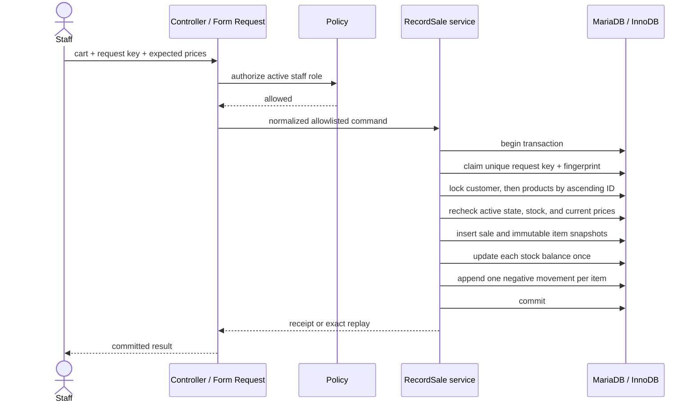
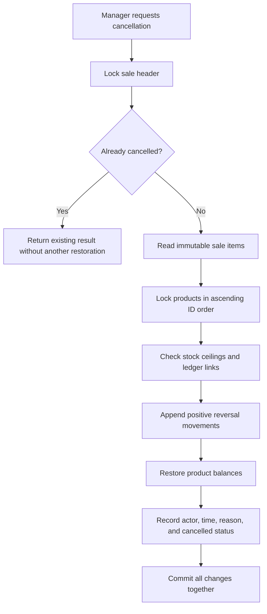

# NexaStock: transaction and evidence overview

## What the project demonstrates

NexaStock is a Laravel and MariaDB course project centered on database correctness. It records multi-item sales, deducts inventory, preserves sale-time product facts, supports a once-only full cancellation, and provides reconciliation queries that compare cached stock with an append-only movement ledger.

The key design choice is that one domain service owns each stock-changing transaction. Controllers validate transport input and policies authorize the actor; they do not independently update balances or create ledger rows.

## Sale transaction

The request fingerprint includes the actor, optional customer, and sorted merged items. An exact network retry returns the original committed sale. Reusing the same key with a changed payload produces a conflict.

## Cancellation transaction

Managers can cancel a whole sale once; sales clerks cannot. A second authorized request is an idempotent no-op. If any item would violate a stock bound, the entire cancellation rolls back.

## Data model

Seven business tables keep current operational state and history:

- `users`: authenticated actors and manager/sales-clerk roles;
- `categories` and `products`: catalog data, archival state, optimistic versions, and cached stock;
- `customers`: optional sale association and history;
- `sales`: request-key identity, canonical fingerprint, creator, status, and cancellation metadata;
- `sale_items`: quantity plus immutable SKU, name, and unit-price snapshots; and
- `stock_movements`: signed append-only deltas, resulting balances, reasons, actors, and optional sale-item links.

The full [database design](DATABASE_DESIGN.md) documents functional dependencies, constraints, indexes, lock order, and the conceptual ERD.

## Consistency checks

The reconciliation report treats the ledger as the audit trail and checks:

- cached `stock_on_hand` equals the sum of all movement deltas, including products with no movements;
- completed sale items have one matching negative sale movement;
- cancelled items have one matching positive reversal;
- movement product IDs agree with their linked sale items; and
- signed quantities and stored resulting balances follow the expected history.

It reports drift and does not silently repair it.

## Verification evidence

The latest recorded run in [implementation status](IMPLEMENTATION_STATUS.md) reports 20 PHPUnit tests and 97 assertions against the isolated XAMPP MariaDB test database. Coverage includes:

- authorization and direct-request role rejection;
- atomic multi-line sales and rollback on insufficient stock;
- duplicate cart normalization and price-change conflicts;
- one remaining unit contested by two independent processes;
- concurrent retries with the same idempotency key;
- cancellation, archived-product restoration, and stock ceilings;
- report totals and reconciliation; and
- database constraints and restricted mutation paths.

The same status file lists verification that remains open, including a full backup/restore drill, the exact-size performance fixture, additional race/fault injection, keyboard-only review, and a Linux deployment. Those are kept visible rather than implied complete.

## Scope boundary

NexaStock is a one-store course application. It does not implement payments, tax, discounts, suppliers, procurement, warehouses, reservations, partial returns, or inventory valuation accounting. Receipts record sales in the application; they are not proof of payment.

