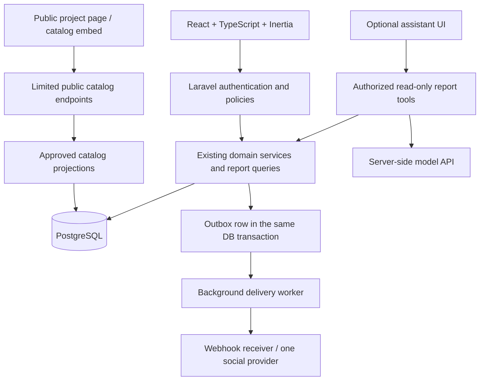

# NexaStock: post-semester GitHub and CV plan

Planning only. Prepared 12 September 2026. No feature, schema, dependency, deployment, account connection, or publishing action is authorized by this document. It extends the future roadmap; the current [SRS](../../docs/SRS.md), migrations, and repository safety rules remain authoritative until an explicit future scope revision.

## 1. Verdict and project identity

Yes: a polished, hosted web application would substantially improve how people can understand and evaluate NexaStock. The existing Laravel/Blade application already spans interface, backend, and database. The future work is to improve that experience, publish a reliable demo, and demonstrate selected integrations.

Position it as **NexaStock — Inventory Operations and Integration Platform**. Its central story is reliable inventory across staff workflows and connected channels. Salesforce is useful inspiration for navigation and connected records; a full CRM, ERP, or commerce suite would dilute this project.

The strongest hiring evidence will be a working demonstration, understandable code, tested failure handling, and the student's ability to explain and change the implementation independently. React, cloud hosting, and AI can add learning value; none substitutes for those foundations.

The provided one-page CS CV uses a project title, a stack line, and roughly three concrete contribution bullets. Follow that format. Its existing Laravel fitness-project example shows that Laravel is a viable way to present full-stack work; NexaStock's distinguishing contribution should be transaction correctness, database migration, and integration reliability. Do not copy another project's impact percentages or claims.

## 2. What to take from the 16 reference images

The images depict an energy analytics application. Borrow its visual hierarchy and interaction patterns, then adapt them to inventory work.

| Reference pattern | NexaStock adaptation | Completion evidence |
|---|---|---|
| Dark sidebar, pale canvas, restrained orange/teal accents | Consistent shell with Dashboard, Inventory, Sales, Customers, Reports, Integrations | Responsive navigation and clear current-page state |
| Dashboard cards and trend chart, images 1–2 | Low-stock products, completed sales count/value, stock activity, quick actions | Every number has a documented SQL definition and date range |
| Form beside result, images 3–6 | Sale cart and receipt preview; stock adjustment form and resulting movement | Loading, field errors, stale price/version, and insufficient-stock states |
| Ranked bars and detail table, images 7–8 | Top products/categories by units or recorded sale value | Chart totals match table/export and cancellation rules |
| Date/season charts, images 9–11 | Daily/weekly recorded sales and stock movement trends | Explicit Dhaka date boundaries; no invented profit or forecast figures |
| Interactive controls, image 12 | Filters and optional reorder scenario using explicit assumptions | Clearly label a scenario as a calculation, not an ML prediction |
| Evidence/provenance pages, images 13–14 and 16 | A project case study covering dataset origin, ERD, benchmark method, and tested invariants | Synthetic data labeled; all published measurements reproducible |
| Assistant drawer, image 15 | Optional inventory question assistant with source links | Working hosted backend, timeout recovery, and tested answer accuracy |

Image 15 shows an unavailable AI backend and a local server command inside the user interface. That screenshot does not establish that the whole reference application is broken, but it illustrates why visual completion alone is insufficient. NexaStock should show a useful temporary-unavailability message and keep normal inventory workflows usable.

Use a compact operational dashboard after login. Put the larger introduction, screenshots, demo button, GitHub link, and technical case study on a small public project page. Keep documentation and engineering metrics there instead of filling the staff interface with infrastructure badges.

Design requirements: readable tables; keyboard operation; visible focus; labels on controls; accessible chart summaries; loading/empty/error states; price-change recovery; confirmation for sale cancellation; preserved filters; usable layouts at 360px and 1280px. Desktop screenshots alone are not a responsiveness check.

## 3. Target architecture and technology decisions

Recommended future stack: **a supported Laravel/PHP release + React + TypeScript + Inertia + Tailwind/Vite + PostgreSQL**, with a containerized deployment and GitHub Actions. Select compatible versions when the milestone starts, particularly because the current Laravel/PHP baseline is tied to XAMPP.

Laravel documents Inertia as a way to use React while retaining Laravel routing, controllers, and authentication in one repository. This fits the existing service architecture. [Laravel frontend guidance](https://laravel.com/docs/12.x/frontend)

| Layer | Proposed choice | Reason and boundary |
|---|---|---|
| Business logic | Existing Laravel services | UI changes and integrations must preserve transaction and ledger rules |
| Interactive staff UI | React + TypeScript through Inertia | Learn component state, props, forms, typing, and server interaction without introducing a second backend |
| Styling/charts | Tailwind and one maintained chart library | Select the chart library during implementation; avoid multiple overlapping UI systems |
| Existing API | Preserve `/api/v1` contracts | External adapters use explicitly authorized endpoints; Inertia page responses are a separate presentation contract |
| Database | PostgreSQL after a verified MariaDB release | Provides a meaningful migration and concurrency-learning milestone |
| Hosting | Render Docker web service + managed PostgreSQL as first candidate | One provider reduces initial deployment coordination; verify current costs, region, backups, and worker support before choosing |
| Background work | Laravel queue worker plus durable outbox | External calls happen after commit, outside product locks |
| Session persistence | Explicit shared/persistent storage | Current file sessions cannot simply be assumed durable across ephemeral deploys or multiple replicas |
| Product media | Object storage when catalog/social features need it | Persist actual image files outside ephemeral containers; validate files and retain attribution |
| AI | One server-side model provider behind a small adapter | Keep keys off the browser; select model and budget during that milestone |

Render has an official Laravel/Docker/PostgreSQL deployment example. Treat it as a hosting capability reference, not a ready-made production configuration for this project. [Render Laravel guide](https://render.com/docs/deploy-php-laravel-docker)

Managed PostgreSQL means someone else operates the database infrastructure; it does not replace Laravel authorization, schema design, backups you have verified, or transaction design. Neon is a later hosting alternative worth evaluating if a separate database provider has a concrete advantage. There is no need to select several providers now.

A Next.js rewrite, a Python/FastAPI service, Kubernetes, Kafka, and several databases are outside the recommended release. A hosted model API does not require Python or a venv. Redis becomes useful if the chosen queue/session deployment needs it; it is not an automatic requirement.

## 4. Release roadmap and effort

Assumptions: solo work after semester submission, solid SQL/DBMS understanding, approximately 10–15 focused hours per week, and limited React/cloud experience. Estimates include learning and verification, but external account approvals may add calendar delay.

| Release | Work | Effort estimate | Exit condition |
|---|---|---:|---|
| A: semester baseline | Finish unresolved acceptance evidence, independently explain core code, correct stale documentation, tag the course release | 10–20 hours | Reproducible MariaDB baseline, documented limitations, no unsupported mastery claim |
| B: polished interface | JS/TS foundations, React/Inertia vertical slice, then inventory, sale, receipt, reports, responsive and keyboard verification | 35–55 hours | All existing workflows still work, including errors and roles |
| C: PostgreSQL migration | Separate target schema, conversion, parity suite, isolation/retry checks, query-plan comparison | 20–35 hours | Verified data and behavioral parity, documented rollback |
| D: public demo and GitHub release | Supported runtime, container deployment, HTTPS, persistent sessions, recovery drill, demo access, documentation, video | 20–35 hours | A reviewer can use and reproduce the project without the developer's laptop |
| E: website and webhooks | Published catalog/embed, durable events, signed delivery, retries, delivery history, sample receiver | 25–40 hours | Proven recovery after receiver outage, no duplicated inventory effects |
| F: one differentiator | Choose evaluated read-only assistant OR one real social publishing connector first | 20–35 hours | Real end-to-end evidence plus documented failure cases |

Core portfolio release A–D: approximately **85–145 hours**, or roughly **6–15 weeks** at the assumed pace. Expanded A–F: **130–220 hours**, roughly **9–22 weeks**. Re-estimate after the first React slice. Implementing both AI and social publishing needs an additional milestone; do not silently fit both into F.

Publish a credible CV entry at release D. Webhooks can deepen it at E. AI/social features are optional additions, not reasons to postpone applying indefinitely.

Learning sequence: JavaScript modules/arrays/promises/HTTP -> TypeScript data shapes -> React state/forms -> Inertia requests/errors -> PostgreSQL differences -> containers/TLS/environment configuration -> queues/webhooks -> OAuth or model tools/evaluation.

## 5. PostgreSQL migration as a portfolio contribution

Follow the existing [migration learning guide](../../theory/10_postgresql_migration.md). Preserve a tagged course release. Port raw MariaDB SQL, collation/uniqueness semantics, checks, unsigned IDs, dates, identity sequences, views, database error classification, and runtime grants deliberately.

PostgreSQL defaults to Read Committed. The measured course MariaDB baseline uses Repeatable Read. Rerun concurrency behavior rather than assuming identical outcomes after changing the connection string. [PostgreSQL transaction isolation](https://www.postgresql.org/docs/18/transaction-iso.html)

Use a separate disposable target and compare IDs, row counts, snapshots, exact money, UTC instants, ledger totals, and query outputs. Exercise last-unit sales, identical and changed-payload retries, simultaneous cancellation, archival races, overflow, and whole-transaction retry failure. Keep a migration report with source/target versions and exact evidence.

Current `AGENTS.md` and `tests/TestCase.php` only allow testing on MariaDB `nexastock_test`. Before this future milestone, explicitly revise the testing policy and add an equally strict, separately named PostgreSQL test target. Do not bypass the present guard or point tests at a hosted demo database. No such change is made by this plan.

## 6. Website integration: two distinct deliverables

**Project presentation site:** one public page explaining the problem, three key workflows, screenshots, demo access, short architecture explanation, GitHub link, and video fallback. No pricing page or fabricated customer testimonials are needed for a learning project.

**Catalog integration:** an actual second website consumes a deliberately limited public catalog endpoint, or embeds a responsive catalog view in an iframe. Start with the iframe to reduce authentication complexity; add a documented public read API if useful for learning. Publish only explicitly selected product fields and images. Do not expose customers, internal ledger details, or administrative endpoints. Browser code never receives a staff secret. CORS is not authentication; an embed's allowed parent origins and public data policy should be explicit.

Show available/unavailable status, a refresh timestamp, and a product link. Availability is informational and does not reserve stock. Keep cache expiry short and invalidate/update through committed events where needed. An archived or unpublished item should disappear within a documented maximum delay. This introduces explicit product publication metadata; an active internal product is not automatically public.

Later, an inquiry form may create a separate inquiry record for staff review. It is not a sale or stock reservation. Actual external checkout, payment, shipping, partial returns, and WooCommerce/Shopify order synchronization require their own order-state and stock-ownership design and are outside A–F.

## 7. Webhooks: the highest-value first integration

Start with outbound events such as `sale.recorded`, `sale.cancelled`, and `inventory.low_stock`. Define low stock as a threshold crossing to prevent repeated alerts on every sale below the threshold. Use one receiver you control before supporting arbitrary connectors.

A stock sale writes the sale, movements, balance updates, and an outbox event in one transaction. A worker later sends the event. This closes the gap where the sale commits but the process crashes before queuing the notification. Transport is at-least-once; receivers deduplicate using a stable event ID. Do not claim exactly-once network delivery.

Proposed envelope: event UUID, schema version, event type, UTC occurrence time, aggregate ID/version, and minimum necessary payload. Sign the raw payload with an endpoint secret and delivery timestamp; use HTTPS, timeout limits, bounded exponential backoff with jitter, and secret rotation. Retry a delivery without creating a new business event.

Store each attempt's outcome and expose a manager delivery screen with pending/delivered/exhausted status and manual redelivery. Limit response-body retention and redact secrets. Protect configurable destinations against requests to loopback, private-network, or cloud metadata addresses; constrain redirects and revalidate destinations.

The receiver validates signature/time window, durably records acceptance, then acknowledges promptly. Enforce uniqueness on the event identity; replays must not repeat the business side effect. For out-of-order availability events, compare aggregate versions or fetch current state. GitHub's official guidance illustrates secrets, HTTPS, prompt acknowledgement, and stable delivery IDs; exact timeouts and headers for NexaStock must be defined in its own contract. [GitHub webhook practices](https://docs.github.com/en/webhooks/using-webhooks/best-practices-for-using-webhooks)

Acceptance scenarios: invalid signature; stale timestamp; duplicate event; receiver returns 500; receiver times out after applying the effect; worker restarts after database commit; exhausted retry; manual redelivery; events arrive out of order. Show that a failed external delivery never rolls back an already committed sale or holds product locks open.

If inbound events are added, start with a signed external inquiry event. Resolve the connector identity on the server. A third-party payload must never pick an arbitrary staff actor or directly set stock. Mapping an external order to a sale requires a separate authorized service workflow and state model.

## 8. Social integration: choose a real workflow

| Option | Value | Priority |
|---|---|---|
| Share a public product URL/card | Useful customer-facing distribution with limited complexity | After catalog publication |
| Manager drafts and approves a product post, then publishes to one connected account | Teaches OAuth, token lifecycle, media storage, background jobs, and external failures | Optional F milestone |
| Direct-message sales bot, ads, social inbox, automatic cross-platform stock sync | Large new product and permissions scope | Defer |

Recommended first social connector: Instagram product publishing if an eligible test account and required permissions are available. Select a product with approved image and description, preview its caption/link strategy, require a deliberate publish action, then record provider ID and result. Price/availability at posting time can become stale; the public catalog remains the current reference. Do not assume social post links behave identically on every platform.

Meta's official collection distinguishes Instagram Login from Facebook Login, describes professional-account eligibility, and identifies publishing permissions. Choose one flow and verify its current account/review requirements before committing to the schedule. An owned-account demonstration is narrower than a publicly approved connector for arbitrary customers. [Meta Instagram API documentation](https://www.postman.com/meta/workspace/instagram/documentation/23987686-9386f468-7714-490f-9bfc-9442db5c8f00)

Plan encrypted provider tokens, OAuth state validation, minimum scopes, disconnect/revocation, expired-token recovery, rate limits, and media errors. When a publish request times out with an uncertain result, reconcile provider status before retrying so a product is not posted twice. A simulated provider is useful for automated tests; label it simulated until a real account round trip succeeds.

## 9. AI assistant: useful and measurable

Use questions the database can answer: 'Which published products are low in stock?', 'What was completed sale value last week?', or 'Show the movements explaining this product's balance.' Laravel authenticates the user and offers a small allowlist of read-only report tools with validated filters. The model receives approved results and explains them with links, filters, and a retrieval timestamp.

Let SQL calculate quantities and money. Do not hand an LLM arbitrary SQL execution or let it create/cancel sales. Enforce permissions inside every tool invocation; instructions in product descriptions or user prompts do not grant privileges. Initially exclude customer personal data from model inputs and avoid retaining raw conversations by default.

A documentation helper can retrieve small approved help passages and cite them. Add embeddings/vector search only if plain search fails on a measured documentation task. Live transactional totals should come from current database queries, not an embedding index.

Create a fixed 40-question evaluation set: 20 factual/report questions, 10 ambiguous/out-of-scope cases, and 10 permission/prompt-injection cases. Proposed release gate: at least 19/20 factual answers correct against SQL truth, all 10 permission cases enforced, all 10 ambiguous cases handled according to their expected clarification/refusal, and no invented numeric answer on timeout. Report the measured result, evaluation data, model/version/date, latency, and cost; this small evaluation is not a universal accuracy claim.

Add request quotas and a server-wide spending cap; disable or degrade the assistant when limits are reached. An unavailable model should leave the normal reports usable. Forecasting is a separate study requiring suitable historical data and baseline/backtesting; synthetic demo sales do not prove business forecasting quality.

## 10. Candidate schema additions, only when needed

These are conceptual future tables, not migrations. Each needs a scoped SRS change, ownership rules, constraints, retention policy, and mapped tests before implementation. The seven-table academic release remains separately reproducible.

| Extension | Candidate records and key constraints |
|---|---|
| Published catalog | `product_publications` with unique product FK, publication state and public slug; `product_media` with product FK and object storage key |
| Outbound events | `outbox_events` with unique event UUID, aggregate/version, type, schema version, payload and creation time |
| Webhook endpoints | `webhook_endpoints` with approved URL, encrypted secret and enabled state |
| Delivery history | `webhook_deliveries` unique on event + endpoint; append-only `webhook_delivery_attempts` with unique delivery + attempt number |
| Inbound connector | `integration_inbox` unique on provider/connection + external event ID; track accepted/processed/failed state |
| Social connection | `integration_connections` for provider account and encrypted tokens; `social_publications` for approved payload, provider ID and lifecycle |
| External mapping | `external_references` unique on connection + external object type + external ID, only if synchronization is implemented |
| Inquiry form | `inquiries` with source, product link, minimal contact fields, consent and review status |
| Assistant | Optional usage records containing aggregate token/cost/latency/tool outcomes; no chat-history tables unless retention has a defined purpose |

Worker claim/state updates belong to operational delivery records. They must not mutate the inventory movement ledger. Document any additional queue/session infrastructure tables separately from business tables.

## 11. GitHub-ready definition

The repository's first screen should answer: what it does, how to try it, what engineering problem it solves, and how to reproduce it.

- Concise README: screenshot, demo/video links, stack, core workflows, architecture diagram, quick start, verification commands, limitations.
- Preserve the course release with an actual tag and release notes. Keep genuine development commits and decision records; no fabricated contribution history.
- Link the ERD, normalization/FD argument, API contract, transaction sequence, migration report, webhook contract, and deployment runbook from the README.
- Reproduce installation on a fresh environment using locked dependencies and synthetic fixtures. Containers supplement the course's XAMPP setup.
- CI checks formatting, frontend typing/build, API contract, relevant integration tests, and browser journeys. Claims that CI passes require an actual GitHub run, not only a workflow file.
- Include a benchmark report with dataset size, machine/provider, concurrency, request count, p50/p95, error rate, and cold versus warm behavior. The prepared workload is not yet measured evidence.
- Show one before/after query-plan improvement using the same dataset and method if a real bottleneck exists. Do not invent a performance percentage to fill a CV bullet.
- Exercise backup restoration and application restart, including sessions and pending deliveries. Record measured recovery times and data checks.
- Public demo uses synthetic data and constrained access. Prefer read-only visitor access first. A writable sandbox needs an isolated disposable environment and controlled reset; it must not reset the academic database or send real social posts/webhooks.
- Verify the demo from another device with the developer laptop off. Record a 2–3 minute fallback video and expected cold-start behavior where relevant.
- Before publication inspect Git's actual tracked file list and history for `.env`, tokens, logs, sessions, SQL dumps, local CV PDFs, rendered CV images, personal attachments, and third-party reference images. Current ignore rules do not automatically exclude every local reference folder. Keep only authorized, attributed showcase assets and select an appropriate code license.
- State your actual contribution and use of code-generation assistance in the project write-up where appropriate. Be able to independently explain, debug, and extend the code you list on the CV.

One current documentation inconsistency to resolve at release A: the SRS introduction still says no features are implemented, while the implementation status reports completed work. Treat the SRS as behavior authority and the status file as execution evidence until that wording is synchronized. This planning pass does not re-audit or rerun the existing 20-test suite.

## 12. CV-ready definition and draft entry

Use the sample CV's compact format. List only technologies you actually used and can explain. Three bullets should cover product scope, technical depth, and verified delivery or a distinctive integration. Test counts can support your evidence but need not dominate the CV.

**Future target wording — use only after the corresponding work is complete:**

**NexaStock — Inventory Operations and Integration Platform** | GitHub | Live Demo

*Stack: Laravel, React, TypeScript, PostgreSQL, Docker, GitHub Actions*

- Built and deployed an inventory application with role-based workflows, interactive reporting, and a published product catalog.
- Implemented atomic sales and cancellations using row locks, idempotency keys, and an append-only stock ledger; verified concurrent last-item purchases and cross-database migration parity.
- Developed signed webhooks with transactional event persistence, background retries, and duplicate-event handling; demonstrated recovery from receiver outages without repeating business effects.

If the assistant becomes the main differentiator, replace the third bullet with a precise description and the actual evaluation result. If social publishing is stronger, describe the single provider, authorization flow, and delivery reconciliation. Do not cram every extension into the stack line.

For an earlier semester-only entry, use Laravel, Blade, MariaDB, and PHPUnit, and describe only completed course workflows and verified transaction behavior. Do not list React, PostgreSQL, public hosting, webhooks, or AI until implemented and personally understood.

| CV claim | Evidence required |
|---|---|
| Full-stack application | Working interface-to-database journeys and independent explanation |
| Deployed | Public URL working without the local laptop and repeatable deployment |
| Concurrent correctness | Repeatable overlapping transaction tests and documented scope |
| PostgreSQL migration | Data comparison, target-engine tests, constraint/grant verification, rollback record |
| Reliable webhooks | Real sender/receiver trace plus outage, duplicate, and uncertain-response tests |
| Social integration | Real provider-authenticated account round trip, not only a share link or mock |
| Grounded assistant | Fixed evaluation set, SQL/source links, permission enforcement, failure behavior |
| Faster by X% | Reproducible baseline, changed method, identical workload, actual measurements |

Interview readiness: explain an ERD relationship, write a multi-table report query, justify an index using its plan, draw a last-item race, explain a transaction rollback, distinguish idempotency from authorization, explain the outbox crash gap, explain duplicate delivery, and make a small unfamiliar code change without relying on a generator.

## 13. Recommended stopping point

Aim for release D first: a polished React/Laravel application, verified PostgreSQL migration, hosted demo, and readable engineering evidence. Add release E next because webhooks naturally extend the database work into distributed-system failure handling. Pick AI or social publishing after that according to learning interest and available accounts/budget.

The end product should demonstrate one coherent chain: receive stock -> sell -> inspect the ledger -> cancel once -> see the report update -> deliver an integration event -> recover cleanly when the receiver fails. That is a substantial project with a defensible CV story even without payments, multi-tenancy, or a large menu of integrations.
